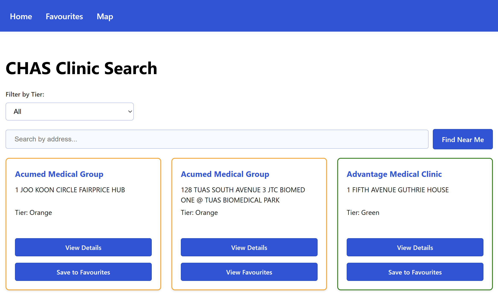

# CHAS Clinic Finder

A simple and fast web application to find Community Health Assist Scheme (CHAS) clinics in Singapore. Users can search for clinics by address, filter them by their CHAS tier (Blue, Orange, or Green), and save their favourite clinics for easy access. There is also a map feature that will show the locations of the clinics based on the co-ordinates found in the API. Calculations done for the use of function 'Find near me' are done thru the use of the Haversine Formula.

## Introduction

This project was built to provide a clean and modern interface for an essential public dataset, making it easier for users to find the healthcare they need.

## Getting Started

A publicly deployed version of the app is not yet available. To run the project locally:

1.  Clone the repository.
2.  Install dependencies: `npm install`
3.  Start the development server: `npm run dev`

## Technologies Used

- **JavaScript**
- **React**
- **React Router**
- **Vite**
- **Leaflet**

## Screenshot of Application



## Component Tree

```
App
└── DataProvider
    └── Router
        ├── Navbar
        └── Routes
            ├── Route (path="/")
            │   └── Home
            │       ├── TierFilter
            │       └── ClinicCard
            ├── Route (path="/clinic/:id")
            │   └── ClinicDetails
            ├── Route (path="/favourites")
            │   └── Favourites
            └── Route (path="/map")
                └── Map
```

## all environment variables

```
Please contact for more information
```

## airtable columns

```
- clinicId
- name
- address
- tier
```

## Citation

- Ministry of Health. (2023). _CHAS Clinics (2024)_ [Dataset]. data.gov.sg. Retrieved December 11, 2025 from https://data.gov.sg/datasets/d_548c33ea2d99e29ec63a7cc9edcccedc/view

## Next Steps

- **User Accounts:** Implement user authentication to allow users to sync their favourites across devices.
- **Advanced Filtering:** Add more filtering options and search types, such as name of clinic.
